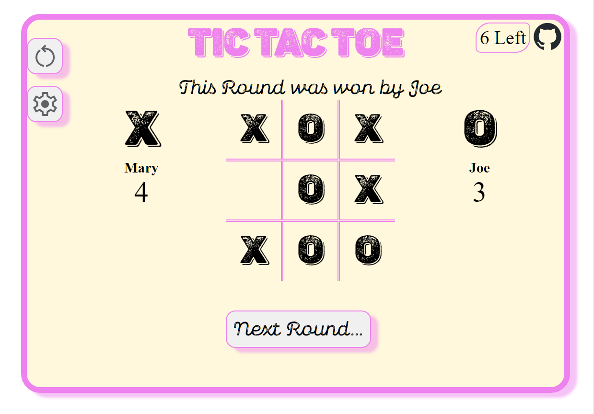

# Project: Tic Tac Toe App - The Odin Project

    

<h2 align="center">
<a href="https://lixoten.github.io/tic-tac-toe-app-odin/">DEMO</a>
</h2> 

## Project Overview
This Tic Tac Toe web application is structured into three distinct components, each serving a unique role in its operation. At the core of the application lies GameController.js, implemented as a factory function. This component encapsulates the game's logic, providing the essential functionalities required for the game to run smoothly.

The application features two interfaces, or views, through which users can interact with the game: ScreenGameController and ConsoleGameController. The ScreenGameController serves as the graphical user interface (GUI), allowing players to engage with the game through visual elements on the screen. In contrast, the ConsoleGameController offers a command-line interface, enabling interaction via textual commands in the console.

Both ScreenGameController and ConsoleGameController leverage the GameController to manage the game's logic, ensuring consistency across different modes of interaction. This design choice promotes modularity and separation of concerns, enhancing maintainability and scalability.

The implementation utilizes ES6 module syntax, facilitating clear and efficient code organization. Additionally, closures are employed to encapsulate variables and functions within scopes, preventing global scope pollution and maintaining clean, modular code.

In summary, this application is designed with a focus on modularity, using ES6 modules and closures to ensure a clean architecture without reliance on global variables.

## Curriculum and Topics Explored

- **Front-End Development**: Building the user interface using HTML, CSS, and JavaScript.
- **Responsive Design**: Creating a layout that is responsive.
- **Back-End Development**: Handling dynamic content and user interactions through JavaScript.
- **Event Handling**: Managing user events such as clicks and form submissions.
- **DOM Manipulation**: Dynamically updating the webpage content based on user actions.
- **Custom Properties (CSS Variables):** Used for consistent styling.
- **JavaScript (ES6)**: Implementing game logic, utilizing modern JavaScript features such as modules and closures.
- **Web Modules**: Leveraging ES6 modules for organized and efficient code management.
- **CSS Grids**

## Project Structure

The project is divided into three main components:
1. **GameController.js:** Acts as the central hub for the game logic, implemented as a factory function.
2. **ScreenGameController:** Manages the graphical user interface, allowing players to interact with the game visually.
3. **ConsoleGameController:** Handles the console interface, enabling gameplay through textual commands.

## Console Game Version
- Simplified version
- To Run:     
  * node js/runConsoleGame.js

### Project Specification
[Project: Tic Tac Toe](https://www.theodinproject.com/lessons/node-path-javascript-tic-tac-toe)

### Notes

Ideas and things we can go to improve
* Features
    * These Dark, Light
    * Save game stats Local Storage
    * A stat page
    * Enhance the ConsoleGame a bit more.

